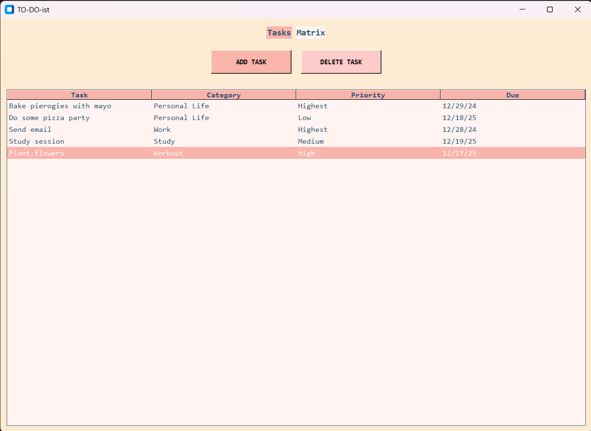
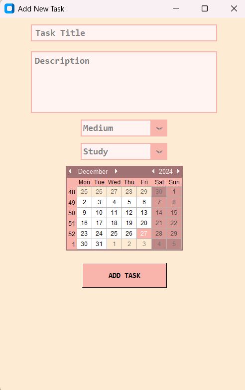
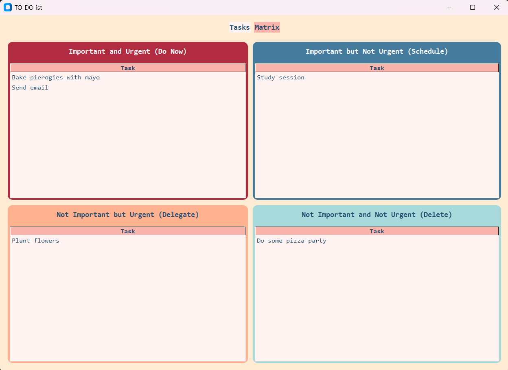

# ToDo-ist

ToDo-ist is a task manager application designed to help you manage your daily activities more effectively. Unlike traditional task managers, ToDo-ist integrates pre-trained machine learning to enhance task delegation and prioritization, making it a unique and intelligent solution.  

---

## Table of Contents

1. [Overview](#overview)
2. [Features](#features)
3. [Installation](#installation)
4. [Usage](#usage)
5. [Technologies Used](#technologies-used)
6. [Contributing](#contributing)
7. [License](#license)
8. [Contact](#contact)

---

## Overview

Balancing tasks can feel like an overwhelming challenge, especially when trying to decide what to prioritize. Whether it's work, study, or personal life, the sheer number of decisions can create stress and inefficiency. ToDo-ist offers a powerful solution by automating the decision-making process. Using advanced machine learning algorithms, the app analyzes the details of your tasks and assigns them to appropriate categories in the Eisenhower Matrix. This frees you from the mental burden of constantly deciding and allows you to focus on execution.

ToDo-ist simplifies task management for individuals who:
- Struggle with procrastination or overthinking.
- Need to handle multiple priorities efficiently.
- Want a streamlined system to organize their day.

By automating decisions and providing a clear structure, ToDo-ist transforms how you approach daily productivity.

---

## Features

- **Intelligent Task Delegation**: Uses SVM classification to determine the appropriate category for each task.
- **Eisenhower Matrix Integration**: Visual representation of tasks based on urgency and importance.
- **Customizable Categories**: Supports multiple task categories like Work, Study, Personal Life and Workout.
- **Calendar Integration**: Set due dates for tasks using an interactive calendar.
- **User-Friendly Interface**: Built with python.

---

## Installation

Step-by-step instructions to set up the project:

0. Python project version 3.12.8
1. Clone the repository:
   ```bash
   git clone https://github.com/Apewona/TODOist.git
   ```
2. Navigate to the project directory:
   ```bash
   cd TODOist
   ```
3. Install dependencies:
   ```bash
   pip install -r requirements.txt
   ```
4. Run the application:
   ```bash
   python TODOist.py
   ```

---

## Usage

If the app is running, you should see a window where all tasks are displayed:



- To create a new task, click the **ADD TASK** button. Then, you should see the task creation window:

  

- To delete a task, select it from the list and click the **DELETE** button.
- To edit a task, double-click on a task from the list. Then, you should see the task editing window:

  

Tasks are automatically distributed through the Eisenhower Matrix in the **MATRIX** tab:



If you need to manage the Eisenhower task distribution, you can double-click on a task and change its Eisenhower placement.

---

## Technologies Used

- **Programming Language**: Python 3.12.8
- **Frameworks and Libraries**:
  - CustomTkinter and tkinter (for GUI design)
  - SQLite (for database management)
  - SpaCy (for text vectorization)
  - Pickle (for model serialization)
  - Support Vector Machine (SVM) for classification
- **Additional Tools**:
  - tkcalendar (for interactive calendar)

---

## License

This project is licensed under the [MIT License](LICENSE).

---

## Contact

Contact information:
- GitHub: [username](https://github.com/username)

---
